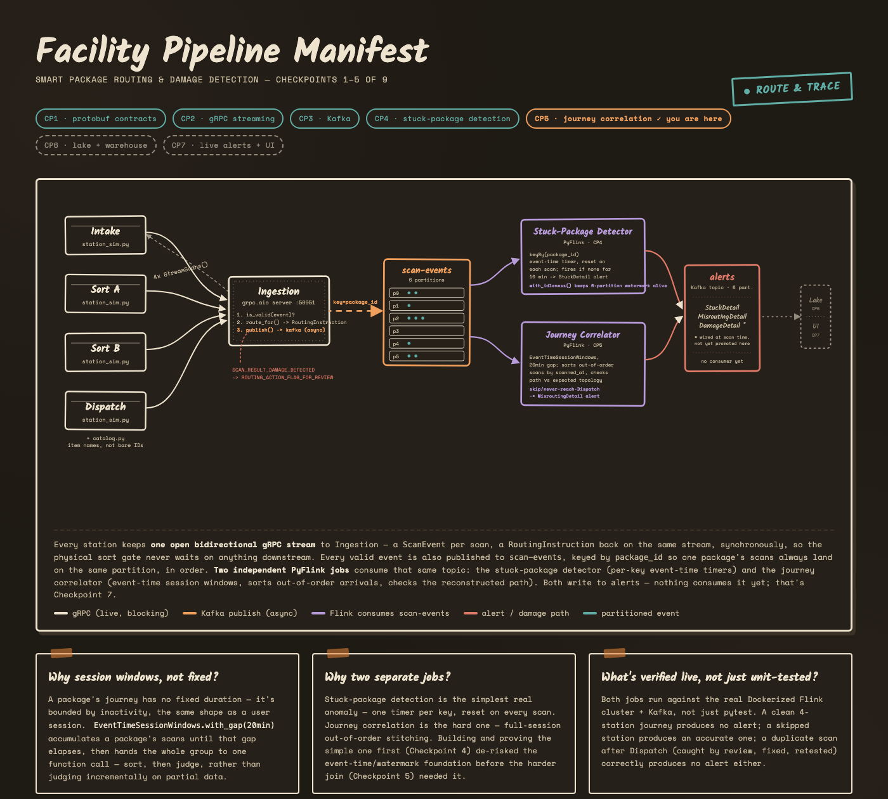

# Smart Package Routing & Damage Detection Platform

## The problem

A package moving through a sorting facility (Intake → Sort A → Sort B →
Dispatch) fails in three ways that matter to a customer: it gets
**damaged** in transit, it gets **stuck** at a station and nobody notices
for hours, or it gets **misrouted** — skips a station, loops back, or
never reaches Dispatch at all. By the time any of that surfaces as a
support ticket, the package is already late or ruined. The only way to
catch it earlier is to watch every scan as it happens and reason about
it in real time, not after the fact in a nightly report.

That's a streaming problem, not a batch one — and the hardest part of
it isn't detecting damage on a single scan (that's a lookup), it's
reconstructing a package's **whole journey** from scan events that
arrive out of order, on their own schedule, with no guarantee the
journey has finished yet.

## Approach

The platform is built as four layers, each one proven working
end-to-end (not just unit-tested) before the next was started:

1. **Capture** — every station keeps one open bidirectional gRPC stream
   to an ingestion service. A scan goes up, a routing instruction comes
   back down the same stream, synchronously — the physical sort gate
   never blocks on anything downstream of it.
2. **Decouple** — the ingestion service publishes every valid scan to
   Kafka as a side effect, keyed so one package's scans always land on
   the same partition in order. This is what lets everything after it
   be slow, batched, or offline without stalling the conveyor belt.
3. **Reason** — two independent stream-processing jobs read that same
   Kafka topic: one flags a package that's gone quiet too long, the
   other reconstructs each package's full path and checks it against
   what the path *should* have been.
4. **Persist** — every anomaly becomes an `Alert` on its own Kafka
   topic. From there it splits two ways: raw scan events land in a
   Parquet data lake (full history, cheap storage), and alerts get
   loaded into ClickHouse with a pre-aggregated hourly rollup (fast
   dashboard queries — count by type/severity without scanning raw
   rows every time).
5. **Surface** — a live dashboard subscribing to alerts in real time is
   the last piece (in progress — see Roadmap).

The stuck-package detector was deliberately built and proven *before*
the journey correlator, even though both consume the same topic — it's
the simpler anomaly (one timer per package, reset on every scan) and it
exercises the same event-time/watermark machinery the harder job needs,
so any foundational bug surfaces on the easy problem first.

## Architecture



**[Open the interactive version →](docs/architecture.html)** (hand-drawn
facility manifest, themed for light/dark) ·
[published copy](https://claude.ai/code/artifact/42406ee7-f0b6-4949-8870-116059d91b76)

Four scan stations stream into one ingestion service over gRPC. Every
valid scan is published to Kafka's `scan-events` topic, partitioned by
`package_id`. Two PyFlink jobs consume that topic independently and
write to a shared `alerts` topic.

**Why this shape, not a simpler one:**

| Decision | Why | What it buys |
|---|---|---|
| gRPC doesn't wait on Kafka | `route_for()` answers before the Kafka publish is even awaited — it runs as a tracked background task | A slow or momentarily unreachable broker delays analytics, never the physical sort gate |
| Partition key is `package_id`, not station | Station only has 4 values (caps parallelism at 4, no per-package ordering); `package_id` is the only key that guarantees one package's scans stay in arrival order on one partition | The journey correlator can trust ordering-within-a-partition instead of re-deriving it from scratch across the whole topic |
| Two separate Flink jobs, not one | Stuck-detection is a single per-key timer; journey correlation is a full out-of-order session join | Proving the simple job first caught real watermark/timestamp-assigner bugs before they could hide inside the harder job |
| Session windows, not fixed windows | A package's journey has no fixed duration — it's bounded by inactivity, not a clock | `EventTimeSessionWindows.with_gap(20min)` accumulates a package's scans until the gap elapses, then judges the whole path at once instead of guessing on partial data |

## Tech stack

| Layer | Choice | Why |
|---|---|---|
| Services (ingestion, station sim) | **Python + grpc.aio** | Bidirectional streaming with async concurrency; one language across services and stream jobs |
| Message bus | **Kafka (KRaft mode)**, no ZooKeeper | Decouples ingestion from processing; local via Docker Compose, one command to stand up |
| Stream processing | **PyFlink (DataStream API)** | Real event-time semantics — watermarks, session windows, per-key timers — the actual tool for out-of-order journey reconstruction, not a hand-rolled approximation |
| Schema | **Protobuf**, `buf`-linted | One schema, three consumers (gRPC, Kafka, Flink); evolution rules (reserved fields, `UNSPECIFIED` enum zero-values) enforced from the first commit |
| Catalog | **SQLite**, generated seed data | 50k realistic items so packages show names, not bare UUIDs — no external DB needed for local dev |
| Data lake | **Parquet**, Hive-partitioned by date/hour | Full raw-event history at low storage cost; a Python consumer (not a Flink job — no windowing/joins needed for "durably persist what already exists") batches scan-events straight to disk |
| Warehouse | **ClickHouse** | Pre-aggregated hourly rollups via a materialized view — a dashboard query never scans raw alert rows, it reads a running count that updates itself as data lands |
| Live view | **React + grpc-web + Envoy** | Genuine gRPC end-to-end, not an SSE bridge — Envoy translates grpc-web to native gRPC since browsers can't read HTTP/2 trailers; one long-lived server-streaming call pushes position updates and alerts as they happen |
| Batch layer | **Dagster** | Daily-partitioned assets reprocess the raw Parquet lake for full-day metrics streaming shouldn't compute on the hot path (throughput, damage rate by item category) plus a reconciliation check against streaming's own output — isolated in its own virtualenv since Dagster's protobuf pin conflicts with the gRPC/Flink stack's |
| Infra | **Docker Compose** | Kafka + Flink JobManager/TaskManager + ClickHouse + Envoy + Dagster, one `docker compose up` |

## Roadmap

- ✅ Protobuf schema contracts, evolution rules enforced via `buf`
- ✅ gRPC bidirectional streaming (station ↔ ingestion)
- ✅ Kafka decoupling, partitioned by `package_id`
- ✅ Stuck-package detection (PyFlink, per-key event-time timers)
- ✅ Journey correlation (PyFlink, event-time session windows, misrouting detection)
- ✅ Data lake + warehouse (raw events to Parquet, alerts + hourly rollups to ClickHouse)
- ✅ Live alert/query gRPC service + frontend (grpc-web + Envoy, React facility view)
- ✅ Batch layer (Dagster: daily throughput, damage rate by item category, lake-vs-streaming reconciliation)
- ⏳ CI/CD and DevOps hardening

---

## Setup

```bash
python3 -m venv .venv
source .venv/bin/activate
pip install -r requirements.txt
./scripts/codegen.sh             # regenerates gen/python/ from proto/
python3 scripts/seed_catalog.py  # generates data/catalog.db (50k items by default)
docker compose up -d             # starts Kafka, creates topics, starts the Flink cluster
```

`data/catalog.db` is gitignored (regeneratable, deterministic given the
same `--seed`) — the station simulator reads it to attach a real item
name to each simulated package, so log/alert output shows e.g.
`"Corelume Mechanical Keyboard #23"` instead of a bare `package_id`.

**PyFlink is Docker-only** — it needs a JVM and isn't installed in the
local venv. Job code lives in `stream_processing/jobs/` but only runs
inside the `thing-transfer-flink` image (built automatically by
`docker compose up`).

## Layout

```
proto/                       protobuf schema source of truth (buf-managed)
gen/python/                   generated Python stubs (gitignored, regenerate with codegen.sh)
services/ingestion/            gRPC server: receives ScanEvents, publishes to Kafka, returns RoutingInstructions
services/station_sim/          gRPC client: simulates a scan station
services/common/catalog.py      read-only access to the item catalog (data/catalog.db)
stream_processing/jobs/         PyFlink jobs (stuck-package detection, journey correlation)
stream_processing/flink_image/   Dockerfile: Flink + PyFlink + Kafka connector
warehouse/lake_writer/          Kafka consumer: scan-events -> Hive-partitioned Parquet (data/lake/)
warehouse/clickhouse_loader/    Kafka consumer: alerts -> ClickHouse
warehouse/init/                 ClickHouse schema (alerts table + hourly rollup materialized view)
docker-compose.yml               local Kafka (KRaft) + Flink cluster + ClickHouse
scripts/seed_catalog.py          generates data/catalog.db (item names/SKUs/stock)
```

## Submitting Flink jobs

`docker compose up` starts an empty Flink cluster — jobs are a manual
submission step for now (auto-submission via a one-shot container hit a
Flink CLI/RPC hang not worth blocking on; see git history for the
investigation):

```bash
docker compose exec flink-jobmanager \
  /opt/flink/bin/flink run -d -py /opt/flink/usrlib/jobs/stuck_package_detector.py
docker compose exec flink-jobmanager \
  /opt/flink/bin/flink run -d -py /opt/flink/usrlib/jobs/journey_correlator.py
```

Check what's running: `docker compose exec flink-jobmanager /opt/flink/bin/flink list`
Flink Web UI: http://localhost:8081

Override thresholds for faster local testing:

```bash
docker compose exec -e STUCK_THRESHOLD_MS=15000 -e IDLE_PARTITION_TIMEOUT_MS=10000 \
  flink-jobmanager /opt/flink/bin/flink run -d -py /opt/flink/usrlib/jobs/stuck_package_detector.py
docker compose exec -e SESSION_GAP_MS=15000 -e ALLOWED_LATENESS_MS=10000 \
  flink-jobmanager /opt/flink/bin/flink run -d -py /opt/flink/usrlib/jobs/journey_correlator.py
```

**Gotcha**: if you regenerate protos (`./scripts/codegen.sh`) while the
Flink containers are already up, the `gen/python` bind mount can go
stale inside the containers (Docker on macOS sometimes loses track of a
directory that gets `rm -rf`'d and recreated, which `codegen.sh` does).
Symptom: `ModuleNotFoundError: No module named 'packagepb'` even though
the file clearly exists on the host. Fix: `docker compose restart
flink-jobmanager flink-taskmanager`.

## Running the demo

Terminal 1 — start the ingestion service:

```bash
source .venv/bin/activate
PYTHONPATH=gen/python:services/ingestion:services/common python3 services/ingestion/server.py
```

Terminal 2 — run a simulated station against it:

```bash
source .venv/bin/activate
PYTHONPATH=gen/python:services/station_sim:services/common python3 services/station_sim/simulator.py \
  --station intake --num-packages 5 --count 20 --interval 0.5
```

You'll see scan events sent by the station (with real item names
attached) and routing instructions returned by the ingestion service on
the same stream, correlated by `event_id`. Each valid event is also
published to Kafka's `scan-events` topic — check it landed with:

```bash
docker exec thing-transfer-kafka /opt/kafka/bin/kafka-get-offsets.sh \
  --broker-list localhost:9092 --topic scan-events
```

## Tests

```bash
source .venv/bin/activate
python3 -m pytest services/ingestion/tests/ services/common/tests/ warehouse/tests/ -v  # fast suite, no Docker needed
python3 -m pytest services/ingestion/tests/ -v -m kafka                 # requires: docker compose up -d
```

The fast suite includes pure unit tests of the routing decision logic
and end-to-end streaming tests (real `grpc.aio` server/client pair on
an ephemeral port, fake in-memory Kafka producer). `test_kafka_integration.py`
is marked `kafka` and excluded by default; it exercises the real broker —
produce via gRPC, consume back, decode, and verify.

Flink job tests (needs pyflink, which only exists inside the Docker
image — see `scripts/run_flink_tests.sh`):

```bash
./scripts/run_flink_tests.sh
```

## Reading alerts

```bash
docker exec thing-transfer-kafka /opt/kafka/bin/kafka-console-consumer.sh \
  --bootstrap-server localhost:9092 --topic alerts --from-beginning
```

Values are base64-encoded `Alert` protos (see
`services/ingestion/kafka_producer.py` docstring for why) — decode with:

```python
import base64, sys
sys.path.insert(0, "gen/python")
from packagepb.v1 import alert_pb2
alert_pb2.Alert.FromString(base64.b64decode(line))
```

## Warehouse: lake writer + ClickHouse loader

Both are standalone Python Kafka consumers, not Flink jobs — neither
needs windowing/joins, just "durably persist what already exists."

```bash
source .venv/bin/activate
PYTHONPATH=gen/python python3 warehouse/lake_writer/writer.py       # scan-events -> data/lake/
PYTHONPATH=gen/python python3 warehouse/clickhouse_loader/loader.py # alerts -> ClickHouse
```

Query the warehouse (default local credentials, set in `docker-compose.yml`):

```bash
curl -u default:thing-transfer-local http://localhost:8123/ --data \
  "SELECT hour, alert_type, countMerge(alert_count) AS alerts
   FROM alert_hourly_rollup GROUP BY hour, alert_type ORDER BY hour"
```

Both consumers commit Kafka offsets only after a successful
write/insert (not on Kafka's own auto-commit timer) — a crash mid-batch
re-processes those messages on restart instead of silently dropping
them.
